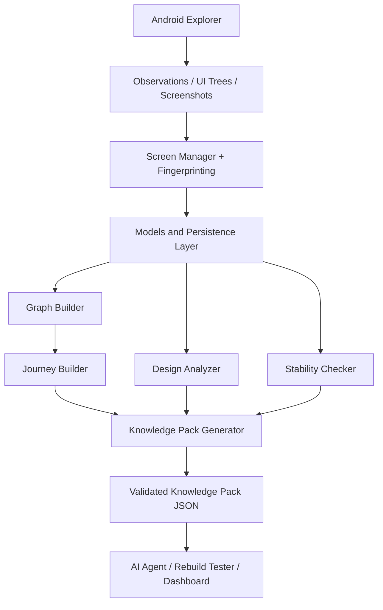

# RevRag AI — Knowledge Engine

> The Knowledge Engine component of the RevRag AI In-App Agent (Member 3 Standalone Contribution).

---

## 1. Project Title

**RevRag AI — Knowledge Engine**  
*The semantic synthesis, state tracking, and knowledge compilation engine for autonomous Android reverse-engineering.*

* **Owner:** Sneha (Member 3)
* **Git Branch:** `member3/knowledge-engine`
* **Schema Contract:** `schemas/knowledge_pack.v0_2.schema.json` (`0.2.0-provisional`)

---

## 2. Overview

The **Knowledge Engine** is the core semantic synthesis and state-tracking component of the **RevRag AI** autonomous mobile reverse-engineering platform.

When an automated Android exploration agent navigates an application, it captures raw, high-frequency telemetry: low-level UI view hierarchies, screen captures, and action events. On their own, these raw signals do not constitute an architectural or functional understanding of the application. Dynamic data causes screens to vary between visits, widgets renumber across activity lifecycles, and circular navigation loops obscure distinct task flows.

The Knowledge Engine bridges this gap by translating raw exploration streams into a structured, unified, and queryable **Knowledge Base**. It is responsible for:
* **Deduplicating screen states** using canonical cryptographic UI fingerprints invariant to layout jitter.
* **Modeling the application topology** as a directed multigraph of screens and interactive transitions.
* **Discovering end-to-end user journeys** across the navigation graph.
* **Extracting visual design language and layout patterns** from screenshots and element geometry.
* **Evaluating explorer repeatability** across multiple test scans through stability scoring.
* **Compiling a standardized, versioned Knowledge Pack** artifact consumed downstream for app understanding, dashboard visualization, and full application rebuilding.

> [!NOTE]
> This folder represents the self-contained, standalone contribution of **Member 3 (Sneha)** for the RevRag AI project.

---

## 3. Problem It Solves

During automated mobile exploration, several practical challenges arise:
1. **Unstructured & Volatile Telemetry:** Raw Android observations, screenshots, and XML/JSON UI trees are too low-level and noisy to use directly for reasoning or code generation.
2. **Screen Identity Ambiguity:** The same logical screen often displays dynamic elements (clocks, notifications, live lists) or transient element IDs, leading naive systems to treat every observation as a new screen.
3. **Disconnected Transitions:** Exploration actions and transitions occur across asynchronous events, making it hard to track cause-and-effect navigation relationships.
4. **Downstream Need for Clean Knowledge:** Downstream AI agents, rebuild engines, and visualization dashboards require a single, clean, structured representation of an app's UI elements, screens, flows, and design tokens without having to parse raw ADB logs or device dumps.

The Knowledge Engine solves these issues by organizing unstructured exploration telemetry into deduplicated screens, validated elements, explicit transitions, traversable journeys, design profiles, and schema-validated **Knowledge Packs**.

---

## 4. Responsibilities

The standalone Knowledge Engine implements and verifies the following responsibilities:

* **Screen and UI Element Representation:** Strongly-typed Pydantic v2 schemas and SQLite relational models representing view hierarchies, clickable/scrollable states, resource IDs, accessibility labels, and pixel bounding boxes.
* **Screen Fingerprinting:** Cryptographic exact SHA-256 hashing (normalizing text, attributes, and sorting order) and text-insensitive structural fingerprinting (16px-bucketed bounds).
* **Screen Deduplication & Identity Matching:** Assigning persistent `screen_000001` identifiers, deduplicating repeated visits, and merging newly discovered elements.
* **Action and Transition Storage:** Persisting user action events (`tap`, `type`, `swipe`, etc.) and recording directed transition edges between verified screens.
* **UI Graph Construction:** Assembling directed multigraphs (`NetworkX MultiDiGraph`) of screen nodes and transition edges; computing graph topology metrics.
* **Journey Discovery:** Extracting bounded, cycle-safe shortest-path navigation flows from entry points and inferring semantic journey names from element text heuristics.
* **Design Analysis:** Computer vision image processing (`OpenCV`) extracting dominant color palettes via k-means clustering, background colors, contrast ratios, and spatial element spacing.
* **Stability and Repeatability Checking:** Performing multi-pass cross-scan comparisons (exact, structural, and Jaccard similarity) to score explorer repeatability.
* **Knowledge Pack Generation:** Compiling a deterministic, sorted, and complete knowledge artifact containing all discovered entities.
* **JSON Schema Validation:** Enforcing strict schema conformance against `schemas/knowledge_pack.v0_2.schema.json` using `jsonschema.validate()`.
* **Persistence & Repository Operations:** Atomic transaction management (`BEGIN IMMEDIATE`), Write-Ahead Logging (`WAL`), and foreign key enforcement in SQLite.
* **FastAPI Service & Health Probing:** RESTful API with automated startup lifecycle, dependency-injected scan isolation, and `/health` monitoring.
* **Test Coverage & Validation:** 100% automated test suite passing with isolated per-test ephemeral database fixtures.

---

## 5. Architecture

The Knowledge Engine is architected with strict layer boundaries: core domain modules operate on pure Python dictionaries and primitives, Pydantic manages schema validation at the HTTP boundaries, and SQLite handles persistent storage.



> [!IMPORTANT]
> The **Android Explorer / Controller** (Member 1 — Pallavi), the **Autonomous Exploration Agent** (Member 2 — Deekshitha), the **Frontend Dashboard** (Member 4 — Suma), and the downstream **Rebuild Engine** are owned by other team members and are not included in this folder.

---

## 6. Main Components

The `knowledge/` package contains 14 specialized Python modules:

| File | Purpose | Main Responsibility | Contribution to the Engine |
| :--- | :--- | :--- | :--- |
| [`api.py`](file:///c:/Developers/Sneha/Projects/RevRag_AI/knowledge-engine/knowledge/api.py) | FastAPI HTTP Application | Exposes REST endpoints for telemetry ingestion, queries, and pack export | Provides the HTTP communication layer connecting external controllers and dashboards |
| [`config.py`](file:///c:/Developers/Sneha/Projects/RevRag_AI/knowledge-engine/knowledge/config.py) | Runtime Configuration | Resolves environment variables, filesystem paths, and defaults | Centralizes system settings (`KNOWLEDGE_DB_PATH`, `SCHEMA_VERSION`, limits) |
| [`database.py`](file:///c:/Developers/Sneha/Projects/RevRag_AI/knowledge-engine/knowledge/database.py) | Database Connection Lifecycle | Manages SQLite connections, pragmas (`WAL`, foreign keys), and transactions | Ensures safe concurrent writes with `BEGIN IMMEDIATE` and clean context managers |
| [`design_analyzer.py`](file:///c:/Developers/Sneha/Projects/RevRag_AI/knowledge-engine/knowledge/design_analyzer.py) | Computer Vision Visual Analysis | Analyzes screenshots via OpenCV; extracts colors (k-means) and spacing | Produces the visual design language profile for downstream app reconstruction |
| [`exceptions.py`](file:///c:/Developers/Sneha/Projects/RevRag_AI/knowledge-engine/knowledge/exceptions.py) | Domain Error Hierarchy | Defines custom exceptions (`NotFoundError`, `ValidationError`, etc.) | Maps domain business errors cleanly to HTTP status codes (404, 409, 422, 500) |
| [`fingerprint.py`](file:///c:/Developers/Sneha/Projects/RevRag_AI/knowledge-engine/knowledge/fingerprint.py) | Screen Cryptographic Hashing | Generates exact SHA-256 and 16px structural screen fingerprints | Guarantees deterministic screen identity invariant to element order and IDs |
| [`graph_builder.py`](file:///c:/Developers/Sneha/Projects/RevRag_AI/knowledge-engine/knowledge/graph_builder.py) | Navigation Graph Synthesis | Builds NetworkX `MultiDiGraph` from screens and transitions | Models application navigation topology and exports node/edge visualization maps |
| [`journey_builder.py`](file:///c:/Developers/Sneha/Projects/RevRag_AI/knowledge-engine/knowledge/journey_builder.py) | User Flow Discovery | Discovers shortest-path navigation flows and infers semantic names | Identifies viable user journeys (e.g., "Login Journey") across the graph |
| [`knowledge_pack.py`](file:///c:/Developers/Sneha/Projects/RevRag_AI/knowledge-engine/knowledge/knowledge_pack.py) | Artifact Assembly & Export | Gathers all entities into a deterministic, sorted Knowledge Pack | Generates and validates the primary JSON artifact consumed by Member 4 |
| [`models.py`](file:///c:/Developers/Sneha/Projects/RevRag_AI/knowledge-engine/knowledge/models.py) | Relational Schema & Dataclasses | Defines SQLite DDL (8 tables), indexes, and row dataclasses | Manages low-level database schemas and row-to-dictionary transformations |
| [`repositories.py`](file:///c:/Developers/Sneha/Projects/RevRag_AI/knowledge-engine/knowledge/repositories.py) | Relational Data Access Layer | Executes parameterized SQL queries for all entities | Encapsulates all database read/write queries behind clean repository functions |
| [`schemas.py`](file:///c:/Developers/Sneha/Projects/RevRag_AI/knowledge-engine/knowledge/schemas.py) | Pydantic v2 Models | Defines API request/response contracts and geometry validators | Validates input bounds, element schemas, and enforces contract compatibility |
| [`screen_manager.py`](file:///c:/Developers/Sneha/Projects/RevRag_AI/knowledge-engine/knowledge/screen_manager.py) | Screen State Manager | Coordinates deduplication, allocates screen IDs, and merges elements | Bridges raw observations into unified screen entities (`screen_000001`) |
| [`stability_checker.py`](file:///c:/Developers/Sneha/Projects/RevRag_AI/knowledge-engine/knowledge/stability_checker.py) | Multi-Scan Comparator | Compares two scans using exact, structural, and Jaccard matches | Computes an objective stability score evaluating explorer repeatability |

---

## 7. Data Flow

The Knowledge Engine processes data through an 11-step pipeline:

1. **Exploration Ingestion:** Android controller or exploration agent posts telemetry (`Observation`, `Action`, `Transition`).
2. **Schema & Bounds Validation:** Input is validated against Pydantic schemas (e.g., ensuring `left <= right` and `top <= bottom` on bounds).
3. **Screen Normalization & Fingerprinting:** UI elements are sorted, text is trimmed/lowercased, and a canonical SHA-256 fingerprint is computed.
4. **Deduplication Check:** The database is queried for matching fingerprints in the current scan. If matched, the existing `screen_id` is reused and elements are merged; otherwise, a new `screen_id` is allocated.
5. **Relational Persistence:** Entities are written into SQLite tables (`screens`, `elements`, `actions`, `observations`) inside immediate transactions.
6. **Transition Recording:** Actions with verified source and target screens generate directed transition records in the `transitions` table.
7. **UI Graph Construction:** NetworkX builds a `MultiDiGraph` with screen nodes and transition edges; invalid orphaned edges are logged as warnings.
8. **Journey Discovery:** Breadth-first shortest paths identify navigation flows from root screens to all reachable endpoints, bounded by length limits.
9. **Visual Design Analysis:** OpenCV clusters screenshot pixel data to extract color palettes, background tones, and vertical spacing metrics.
10. **Knowledge Pack Assembly:** All entities, journeys, design tokens, and statistics are assembled into a sorted, deterministic structure.
11. **JSON Schema Validation:** The pack is validated against `schemas/knowledge_pack.v0_2.schema.json` and saved to `data/output/pack_<id>.json`.

---

## 8. Knowledge Pack

The **Knowledge Pack** is the authoritative, self-contained JSON compilation artifact produced by the Knowledge Engine.

### Contents
* **App Metadata:** Target package name, identified activities, and scan identifiers.
* **Screens:** List of deduplicated screen records (`screen_000001`), activities, fingerprints, and observation counts.
* **UI Elements:** Complete inventory of UI widgets, types, bounds, resource IDs, accessibility descriptions, and interaction flags.
* **Actions:** Exploration actions recorded (`tap`, `type`, `swipe`, `scroll`, `back`, `long_press`, `wait`, `launch`).
* **Transitions:** Directed edges connecting source screens to destination screens triggered by specific actions.
* **Journeys:** Discovered user interaction flows with step sequences, length counts, and inferred semantic names.
* **Design Language:** Dominant color palettes, background colors, text colors, button colors, and spacing metrics.
* **Statistics:** Aggregate counts of screens, elements, actions, transitions, journeys, and graph connectivity metrics.
* **Warnings:** Non-fatal diagnostics (e.g., missing screenshot files or skipped transitions).

### Contract & Schema
* **Schema Path:** [`schemas/knowledge_pack.v0_2.schema.json`](file:///c:/Developers/Sneha/Projects/RevRag_AI/knowledge-engine/schemas/knowledge_pack.v0_2.schema.json)
* **Schema Version:** `0.2.0-provisional`
* **Compatibility:** Preserves mandatory base fields (`pack_id`, `source_observation_ids`) for backward compatibility with `schemas/knowledge_pack.schema.json`.
* **Runtime Output:** Generated packs are saved to `data/output/pack_<id>.json` (e.g., `data/output/pack_000001.json`). These generated files are runtime outputs and are intentionally **ignored by Git**.

---

## 9. Project Structure

The file structure of the `knowledge-engine/` folder is organized as follows:

```text
knowledge-engine/
├── .env.example                        # Example environment configuration template
├── .gitignore                          # Excludes venv, pycache, local databases, output packs
├── GITIGNORE_ADDITIONS.txt             # Reference rules for root repository .gitignore
├── README.md                           # Master Knowledge Engine documentation
├── START_HERE.md                       # Standalone onboarding instructions
├── pytest.ini                          # Pytest configuration and warning filters
├── requirements-knowledge.txt          # Python dependencies for the Knowledge Engine
├── docs/
│   └── knowledge-engine.md             # Technical design rationale, decisions, and assumptions
├── schemas/
│   └── knowledge_pack.v0_2.schema.json # Primary JSON Schema v0.2 contract
├── data/
│   ├── sample/                         # Sample telemetry payloads for testing and onboarding
│   │   ├── action.json                 # Sample tap action payload
│   │   ├── observation.json            # Sample screen observation payload (Login)
│   │   ├── second_observation.json     # Sample screen observation payload (Home)
│   │   └── transition.json             # Sample screen transition edge payload
│   └── output/
│       └── .gitkeep                    # Committed placeholder for generated packs directory
├── knowledge/                          # Core Python package source code
│   ├── __init__.py                     # Package export declarations
│   ├── api.py                          # FastAPI application and route handlers
│   ├── config.py                       # Configuration dataclass and environment parser
│   ├── database.py                     # SQLite connection lifecycle and pragmas
│   ├── design_analyzer.py              # OpenCV screenshot analysis and layout metrics
│   ├── exceptions.py                   # Domain exception hierarchy mapped to HTTP codes
│   ├── fingerprint.py                  # Exact SHA-256 and structural screen hashing
│   ├── graph_builder.py                # NetworkX navigation graph construction
│   ├── journey_builder.py              # Shortest-path journey discovery and naming
│   ├── knowledge_pack.py               # Knowledge Pack assembly, determinism, and export
│   ├── models.py                       # SQLite DDL, table schemas, and row dataclasses
│   ├── repositories.py                 # Parameterized SQL data access layer
│   ├── schemas.py                      # Pydantic v2 validation models
│   ├── screen_manager.py               # Screen deduplication and identifier allocation
│   └── stability_checker.py            # Cross-scan comparison and stability scoring
└── tests/                              # Automated test suite (100 tests)
    ├── conftest.py                     # Pytest fixtures and isolated temporary databases
    ├── test_api.py                     # FastAPI endpoint and integration tests (18 tests)
    ├── test_design_analyzer.py         # OpenCV visual analysis tests (8 tests)
    ├── test_fingerprint.py             # Deterministic screen hashing tests (12 tests)
    ├── test_graph_builder.py           # NetworkX graph construction tests (7 tests)
    ├── test_journey_builder.py         # Pathfinding and journey naming tests (11 tests)
    ├── test_knowledge_pack.py          # Pack assembly and JSON schema tests (10 tests)
    ├── test_models.py                  # Data models and SQLite DDL tests (15 tests)
    ├── test_screen_manager.py          # Screen deduplication and ID tests (11 tests)
    └── test_stability_checker.py       # Repeat-scan stability scoring tests (8 tests)
```

### Ignored Runtime Files
The following local runtime artifacts are actively generated during execution but are excluded from source control by `.gitignore`:
* `.venv/` (Local Python virtual environment)
* `**/__pycache__/` and `*.py[cod]` (Python bytecode caches)
* `.pytest_cache/` (Pytest test runner cache)
* `data/knowledge.db*` (Local SQLite database, WAL, and SHM files)
* `data/output/*.json` (Generated Knowledge Pack compilation artifacts)
* `.env` (Local environment variables containing machine-specific paths)

---

## 10. Installation

All installation commands are designed for **Windows PowerShell** inside the `knowledge-engine/` workspace:

### Step 1: Navigate to the Directory
```powershell
cd C:\Developers\Sneha\Projects\RevRag_AI\knowledge-engine
```

### Step 2: Set Up Virtual Environment
If `.venv` already exists, you can activate it directly:
```powershell
.\.venv\Scripts\Activate.ps1
```

If creating a fresh virtual environment:
```powershell
python -m venv .venv
.\.venv\Scripts\Activate.ps1
```

### Step 3: Install Dependencies
Install all required dependencies:
```powershell
pip install -r requirements-knowledge.txt
```

### Step 4: Configure Environment Variables
Copy the example environment configuration template:
```powershell
Copy-Item .env.example .env
```

---

## 11. Running Tests

### 1. Run Python Compilation Check
Verify that all source and test modules compile cleanly without syntax errors:
```powershell
.\.venv\Scripts\python.exe -m compileall knowledge tests
```

### 2. Run the Automated Test Suite
Execute the full test suite with verbose output:
```powershell
.\.venv\Scripts\python.exe -m pytest -p no:cacheprovider -v
```

### Verified Test Results
```text
100 passed, 0 failed, 0 skipped
```

* **Compilation:** 15 source files and 10 test modules compiled cleanly (0 errors).
* **Execution Time:** ~4.65 seconds across 10 test modules.
* **Test Isolation:** Each test executes against an isolated ephemeral SQLite database (`temp_db`), leaving `data/knowledge.db` untouched.

---

## 12. Running the API

### Start the FastAPI Server
Start the Uvicorn ASGI server hosting the Knowledge Engine API:
```powershell
.\.venv\Scripts\python.exe -m uvicorn knowledge.api:app --reload --port 8100
```

* **Interactive OpenAPI (Swagger) Documentation:** <http://localhost:8100/docs>
* **Alternative ReDoc Documentation:** <http://localhost:8100/redoc>

### Environment Configuration & Database Initialization
* **Configuration:** Handled automatically by `knowledge/config.py` using `.env` or defaults (`KNOWLEDGE_DB_PATH=data/knowledge.db`, `KNOWLEDGE_LOG_LEVEL=INFO`).
* **Database Lifecycle:** `init_db()` is invoked automatically during FastAPI startup lifespan (`@asynccontextmanager`). The SQLite database file and all 8 relational tables are created automatically on boot if not already present.

### Health Endpoint Verification
Probe the service health endpoint using PowerShell:
```powershell
curl http://localhost:8100/health
```

Expected HTTP 200 response:
```json
{
  "status": "ok",
  "service": "knowledge-engine",
  "schema_version": "0.2.0-provisional"
}
```

### API Routes Overview
* `GET /health` — Liveness probe returning service metadata.
* `POST /observations` — Ingests raw Android screen observations; triggers deduplication and element extraction.
* `POST /actions` — Ingests explorer action events; automatically creates transition edges if source and target screens exist.
* `POST /transitions` — Ingests explicit screen-to-screen navigation transitions.
* `GET /screens` — Lists deduplicated screens for a given `scan_id`.
* `GET /screens/{screen_id}` — Fetches a single screen with its full UI element hierarchy.
* `GET /app-map` — Returns graph nodes, edges, statistics, and warnings for UI dashboard rendering.
* `GET /journeys` — Returns discovered shortest-path user navigation flows.
* `POST /knowledge-pack/generate` — Compiles and stores a versioned Knowledge Pack for the specified scan.
* `GET /knowledge-pack/latest` — Retrieves the newest generated Knowledge Pack.
* `POST /stability/compare` — Compares two exploration scans and computes a repeatability score.
* `GET /scans` — Lists all registered exploration scans.

---

## 13. Sample Data and Knowledge Pack Generation

The `data/sample/` folder contains verified sample telemetry:
* [`observation.json`](file:///c:/Developers/Sneha/Projects/RevRag_AI/knowledge-engine/data/sample/observation.json): First screen capture (`MainActivity`) containing a login button and email edit text field.
* [`second_observation.json`](file:///c:/Developers/Sneha/Projects/RevRag_AI/knowledge-engine/data/sample/second_observation.json): Second screen capture (`HomeActivity`) containing a welcome TextView.
* [`action.json`](file:///c:/Developers/Sneha/Projects/RevRag_AI/knowledge-engine/data/sample/action.json): A tap action targeting the login button (`element_000001`).
* [`transition.json`](file:///c:/Developers/Sneha/Projects/RevRag_AI/knowledge-engine/data/sample/transition.json): An explicit transition connecting `screen_000001` to `screen_000002`.

### Method A: Generation via API Workflow
When the API is running on port 8100, ingest the sample data and compile the Knowledge Pack:

```powershell
# 1. Ingest observations
Invoke-RestMethod -Uri "http://localhost:8100/observations" -Method Post -InFile "data/sample/observation.json" -ContentType "application/json"
Invoke-RestMethod -Uri "http://localhost:8100/observations" -Method Post -InFile "data/sample/second_observation.json" -ContentType "application/json"

# 2. Ingest action and transition
Invoke-RestMethod -Uri "http://localhost:8100/actions" -Method Post -InFile "data/sample/action.json" -ContentType "application/json"
Invoke-RestMethod -Uri "http://localhost:8100/transitions" -Method Post -InFile "data/sample/transition.json" -ContentType "application/json"

# 3. Compile the Knowledge Pack
Invoke-RestMethod -Uri "http://localhost:8100/knowledge-pack/generate" -Method Post -Body '{"package_name":"com.example.app"}' -ContentType "application/json"

# 4. Fetch the compiled pack
Invoke-RestMethod -Uri "http://localhost:8100/knowledge-pack/latest" -Method Get
```

### Method B: Programmatic Python Workflow
Generate and validate a pack directly in Python without starting the HTTP server:

```python
import json
from knowledge.database import init_db, transaction, session
from knowledge.screen_manager import ScreenManager
from knowledge import repositories as repo
from knowledge.knowledge_pack import build_pack, validate_pack

# Initialize SQLite database
init_db()

SCAN = "scan_000001"

# 1. Ingest sample observations inside a transaction
with transaction() as conn:
    manager = ScreenManager(SCAN)
    with open("data/sample/observation.json") as f:
        manager.process_observation(conn, json.load(f))
    with open("data/sample/second_observation.json") as f:
        manager.process_observation(conn, json.load(f))
    with open("data/sample/action.json") as f:
        repo.upsert_action(conn, scan_id=SCAN, action=json.load(f))
    with open("data/sample/transition.json") as f:
        t = json.load(f)
        repo.insert_transition(conn, scan_id=SCAN, **t)

# 2. Compile and validate the Knowledge Pack
with session() as conn:
    pack = build_pack(conn, scan_id=SCAN, pack_id="pack_000001", run_design_analysis=False)
    validate_pack(pack)
    print(f"Success: Generated {pack['pack_id']} with {len(pack['screens'])} screens.")
```

> [!NOTE]
> All generated databases (`data/knowledge.db`) and pack files (`data/output/pack_*.json`) are local runtime artifacts and are ignored by Git.

---

## 14. Testing and Verification Summary

The Knowledge Engine has undergone rigorous automated verification. All checks pass cleanly:

| Verification | Result |
| :--- | :--- |
| Python compilation | Passed |
| Module imports | 15/15 passed |
| Automated tests | 100 passed |
| Failed tests | 0 |
| Skipped tests | 0 |
| FastAPI startup | Passed |
| `/health` endpoint | HTTP 200 |
| Knowledge Pack generation | Passed |
| Official JSON schema validation | Passed |
| Sample journey generation | Passed |
| Design Analyzer | Passed |
| Stability Checker | Passed |

---

## 15. Integration Contract

The Knowledge Engine provides clean, well-defined integration contracts for future cross-team collaboration:

### Expected Future Inputs
* **Android Controller (Member 1 — Pallavi):** Screen observations (`Observation`) sent to `POST /observations`, containing the pre-parsed `elements` hierarchy, pixel bounding boxes, activity names, and optional screenshot paths.
* **Exploration Agent (Member 2 — Deekshitha):** Action events (`Action`) sent to `POST /actions`, containing action types (`tap`, `swipe`, etc.), target elements, and source/target screen IDs.
* **Scan Identifiers:** Telemetry scoped by `scan_id` to allow repeat exploration scans without data contamination.

### Expected Future Outputs
* **Structured Screen Entities:** Canonical `screen_000001` identifiers assigned based on cryptographic UI content hashing.
* **Navigation Map:** Node and edge lists (`AppMap`) exported via `GET /app-map` for dashboard visualization.
* **Discovered Journeys:** High-level user interaction sequences (`list[Journey]`) exported via `GET /journeys`.
* **Design Analysis:** Color palettes and layout spacing tokens.
* **Stability Reports:** Cross-scan comparison reports scoring explorer repeatability via `POST /stability/compare`.
* **Validated Knowledge Pack:** Standardized, self-contained JSON compilation artifacts exported via `GET /knowledge-pack/latest` or written to `data/output/pack_<id>.json`.

> [!IMPORTANT]
> This folder is completely self-contained. Integration with Android automation, autonomous AI exploration, dashboard rendering, and rebuild testing will occur at the system integration stage. No teammate code is included or modified in this folder.

---

## 16. Current Status

The standalone Knowledge Engine implementation is complete for its current scope. Its modules compile successfully, the automated test suite passes, the FastAPI application starts, the health endpoint responds successfully, sample Knowledge Packs are generated, and generated packs validate against the official JSON schema.

---

## 17. Limitations and Future Integration

The current implementation is fully verified as a standalone component. The following items represent future integration-level work outside this module's current scope:

* **Android Exploration Controller Integration:** Connecting live emulator exploration feeds directly to `POST /observations`.
* **Autonomous Action-Generation Agent Integration:** Streaming live exploration decisions and action results to `POST /actions`.
* **Frontend Dashboard Integration:** Connecting the React/Web dashboard (Member 4) to `GET /app-map` and `GET /knowledge-pack/latest`.
* **Rebuild Engine Execution:** Consuming the Knowledge Pack JSON to scaffold Flutter/Jetpack Compose components.
* **Shared Schemas & ID Finalization:** Team sign-off to promote `knowledge_pack.v0_2.schema.json` from provisional to approved shared status.
* **Full Team Pipeline Integration:** Packaging the Knowledge Engine service into the project-level Docker Compose stack.

---

## 18. License and Contribution

* **Owner:** Sneha (Member 3)
* **Contribution:** Knowledge Engine
* **Branch:** `member3/knowledge-engine`

This module is currently maintained as part of the RevRag AI team project. Contribution and licensing details will be added at the repository level.
